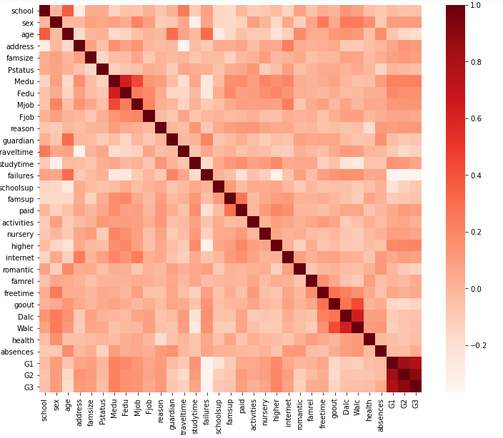
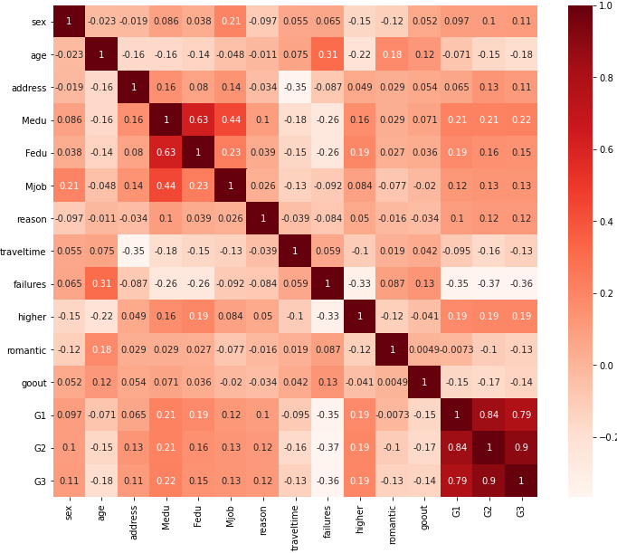

# ensemble_methods_averaging
Calculating math grades at third semester by multi features.

## Feature Selection

Using Pearson correlation matrix for feature selection

The correlation coefficient has values between -1 to 1
+ A value closer to 0 implies weaker correlation (exact 0 implying no correlation)
+ A value closer to 1 implies stronger positive correlation
+ A value closer to -1 implies stronger negative correlation

Mote about feature selection is available at [link](https://towardsdatascience.com/feature-selection-with-pandas-e3690ad8504b).
There are 32 features to predict math grades of student on 3rd semester. By using Pearson correlation matrix, the number of features reduced to 9 which are as follows:

'sex', 'Medu', 'reason', 'traveltime','failures', 'romantic', 'goout', 'G1', 'G2'

The heatmap of all fields is as follows:

## Independent variables need to be uncorrelated with each other. If these variables are correlated with each other, then we need to keep only one of them and drop the rest.

Any two features that are correlated above 0.x (absolute value), are considered as dependent. Only keep the one that has higher correlation with target value G3. The heatmap together with features_corr matrix are the basis for independent features selection.

After feature selection by choosing any field with correlation higher than 20%, the result is as follows:

## Making regression models:

8 different regression models have been used including the following:

+ Linear regression
+ Ridge regression
+ Logistic regression
+ Random forest with 20 tree
+ Random forest with 200 trees
+ Random forest with 120 trees and max depth 3
+ Random forest with200 trees with max depth 5
+ Gaussian Bayes 

At the end all the out puts are averaged together.

## Conclusion

### Averaging the output of all 8 algorithms imrpoved prediction accuracy as follows:

+ Mean Absolute Error: 1.1779733908905832
+ Mean Squared Error: 3.970864130199477
+ Root Mean Squared Error: 1.992702719975932